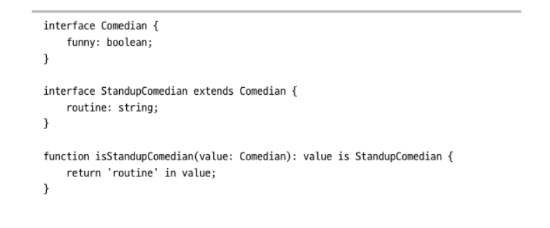

# Ch9. 타입 제한자

## 9.1 top 타입

`never` 타입은 값을 가질 수도 참조할 수도 없는 `bottom` 타입이다.

이와 반대되는 개념으로 시스템에서 가능한 모든 값을 나타내는 `top`타입이 있다.

 

### 9.1.1 any 다시 보기

`any` 타입은 모든 타입의 위치에 제공될 수 있기 때문에 `top` 타입처럼 쓰일 수 있다.
`console.log`의 매개변수와 같이 모든 타입의 데이터를 받아들이는 위치에 `any`를 사용한다.

하지만 `any`는 타입검사를 실행하지 않는다는 치명적인 문제점이 있다.

타입스크립트 상에서는 오류가 없는데 런타임에서 오류가 날 수 있기 때문이다.

따라서 어떤 값이 될 수 있다면 `unknown`타입이 훨씬 안전하다.

 

### 9.1.2 unknown

`unknown`은 진정한 `top`타입이다. `any`와의 차이점은 다음과 같이 훨씬 제한적으로 값을 취급한다는 점이다.

> - 타입스크립트는 `unknown` 타입인 값의 속성에 직접 접근이 불가능하다.

- `unknown` 타입은 `top` 타입이 아닌 타입에 할당이 불가능하다.

직접 접근하기 위해서는 `instanceof`나 `typeof`, 타입 어서션을 통해서 특정 타입으로 제한했을 때만 가능하다.

 

---

## 9.2 타입 서술어

인수가 특정 타입인지 여부를 나타내기 위한 `boolean`값을 반환하는 **타입 서술어**가 존재한다. 사용자 정의 타입 가드라고도 부른다.

`매개변수의 이름 is 특정 타입` 형태로 선언 가능하다.

> 여기서 `return 'routine' in value`가 가능한 문법인가요?

복잡하게 타입 서술어를 사용하면 오히려 타입 검사를 잘못 수행할 수 있으므로 간단하게 사용하는 것을 권장한다.

 

---

## 9.3 타입 연산자

### 9.3.1 keyof

인터페이스에 있는 여러 멤버들의 각 타입을 키 조합으로 관리하기 위해서 `keyof` 연산자를 사용할 수 있다.

`keyof`를 통해 인터페이스의 속성들의 타입을 유니온으로 표현이 가능하기에 수동으로 업데이트하지 않아도 자동으로 연동된다.

 

### 9.3.2t typeof

말 그래도 제공되는 값의 타입을 반환한다. 값의 타입이 직접 작성하기 엄청 복잡하거나 길 경우 사용하면 좋다.

JS의 `typeof`하고는 완전히 다르다. JS에서는 런타임에서 해당 타입에 대한 문자열을 반환하는 연산자이다. TS에서의 `typeof`는 컴파일되지 않고 TS에서 타입을 표현하기 위한 수단이다.

- keyof typeof
  이 둘을 결합해서 사용할 수 있다. 값의 타입이 허용된 키를 간결하게 검색 가능하다.
  인터페이스에 존재하는 속성들의 이름과 타입을 한꺼번에 명시적으로 나타낸다.

 

---

## 9.4 타입 어서션

타입스크립트는 값의 타입에 대한 이해를 돕기 위해 재정의한 구문을 사용한다. 이것을 **타입 어서션**이라고 부른다.

타입 어서션은 `as` 키워드롸 함께 사용한다.

반환된 값에 대해서 추가적인 타입을 재정의할 때 사용하면 좋다.

 

### 9.4.1 포착된 오류 타입 어서션

try catch 구문에서 error가 발생할 경우 이를 출력하기 위해서 error에 대한 타입을 명시하기 위해 타입 어서션을 사용할 수 있다.

또한 예상된 오류 타입인지 확인하기 위해서는 `instanceof` 검사를 통해 타입 내로잉을 추가하는 것이 더 안전하게 error에 대한 타입 검사가 가능하다.

 

### 9.4.2 non-null 어서션

특정 변수가 `null` 또는 `undefined` 타입을 제외한 타입임을 나타내기 위해서는 `!`을 추가하여 나타낼 수 있다. `as`를 통해 나머지 타입을 일일히 지정하는 것보다 훨씬 간편하다.

`Map.get`과 같이 값이 존재하면 특정 타입의 값을 반환하거나 존재하지 않으면 `undefined`를 반환하는 함수나 API에 사용하면 유용하다.

 

### 9.4.3 타입 어서션 주의사항

`any` 타입처럼 타입 어서션은 정 방법이 없을 때 사용하는 도피 수단이다. 따라서 남용하는 것은 좋지 않다. 정석은 정확한 타입을 지정하는 것이 가장 안전한 타입 검사 방법이다.

- 어서션 vs 선언
  변수 타입을 선언할 때 어떤 것이 더 좋은 방법일까?
  타입 어서션으로 타입을 선언하게 되면 일부 경우에 타입스크립트에서는 허용되지만 런타임시 오류가 나는 경우가 발생한다.

따라서 타입 애너테이션을 사용하거나 초기값을 설정하여 변수의 타입을 유추할 수 있도록 하는 것이 안전하다.

- 어서션 할당 가능성
  원시 타입 간 타입 어서션은 허용되지 않는다. 어느 정도 연관성이 있어야 어서션이 가능하다.

이중 타입 어서션도 존재하지만 되도록이면 사용을 지양하자.

 

---

## 9.5 const 어서션

`as const` 구문은 배열에 요소에 대한 타입을 모두 상수로 취급한다는 의미이다.

> - 배열을 읽기 전용 튜플로 취급

- 리터럴 타입으로 지정하므로 원시 타입과 다름
- 객체의 속성은 읽기 전용으로 간주

 

### 9.5.1 리터럴에서 원시 타입으로

원시 타입이 아닌 리터럴로 타입을 지정해줘야 하는 상황에서는 `as const`가 유용할 수 있다.

 

### 9.5.2 읽기 전용 객체

객체 내 멤버의 값의 타입을 리터롤로 지정하고 수정이 허용되지 않기 위해 객체 자체에 const 어서션을 적용하면 유용하다.
